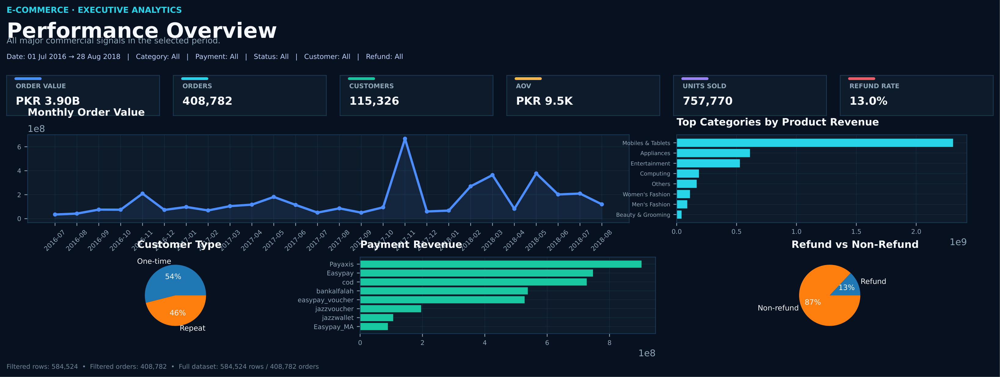
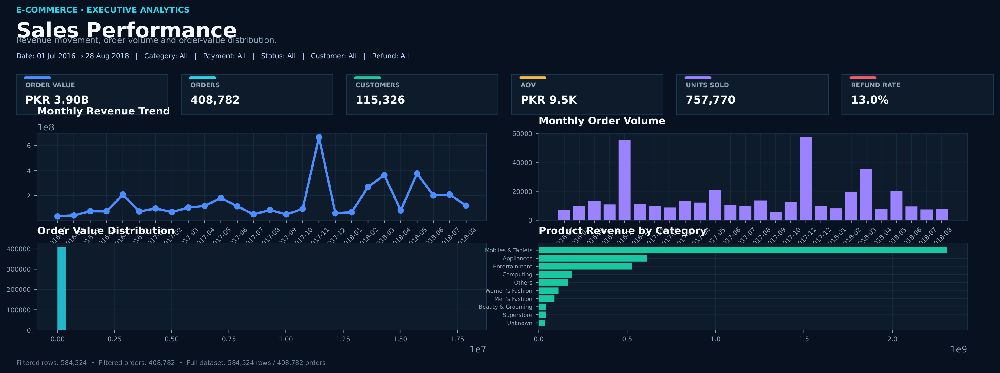
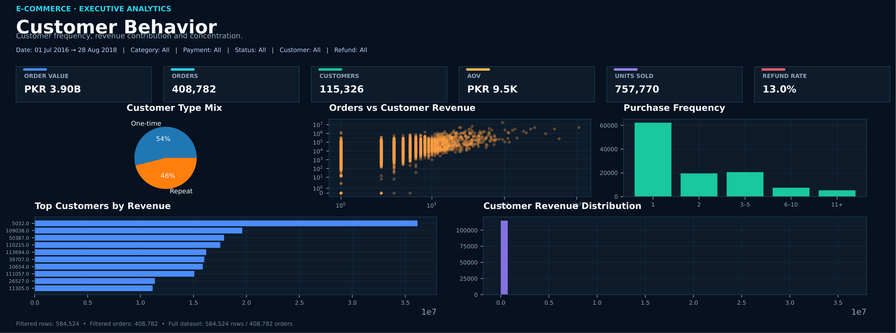
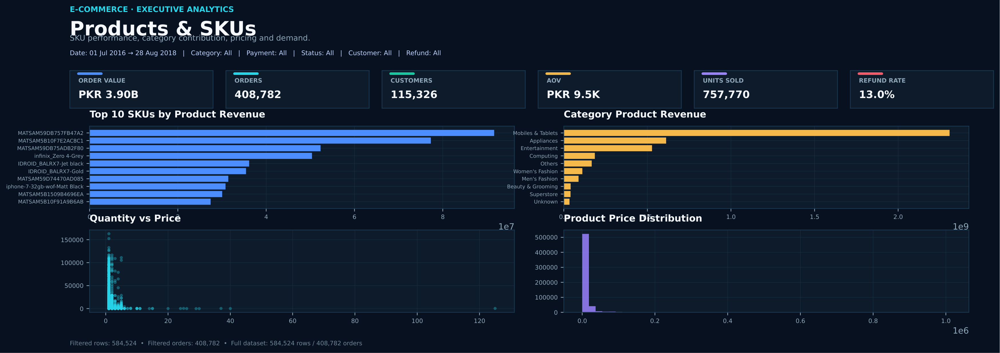
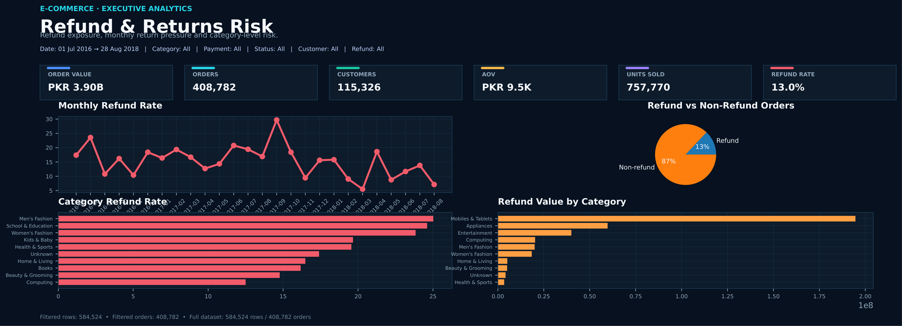
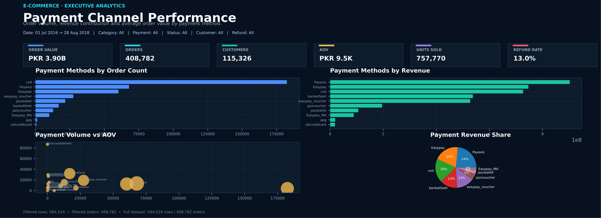

# EcomInsight-Lab

## End-to-End E-Commerce Data Analysis and Business Intelligence

EcomInsight-Lab is an end-to-end e-commerce analytics project built with Python to transform a large transactional dataset into structured, validated, and business-oriented insights.

The project covers the complete analytical workflow, beginning with raw transactional data and progressing through data quality assessment, cleaning, exploratory analysis, customer analytics, product analysis, refund and payment analysis, business insight generation, and interactive dashboard development.

The objective of the project is not simply to visualize historical sales data. It is to understand the underlying behavior of customers, products, orders, revenue, refunds, and payment channels and translate those findings into meaningful business observations.

---

## Table of Contents

- [Project Overview](#project-overview)
- [Business Problem](#business-problem)
- [Project Objectives](#project-objectives)
- [Dataset Overview](#dataset-overview)
- [Data Quality and Cleaning](#data-quality-and-cleaning)
- [Analytical Methodology](#analytical-methodology)
- [Sales Analysis](#sales-analysis)
- [Customer Analysis](#customer-analysis)
- [RFM Customer Segmentation](#rfm-customer-segmentation)
- [Cohort and Retention Analysis](#cohort-and-retention-analysis)
- [Customer Activity Analysis](#customer-activity-analysis)
- [Product and SKU Analysis](#product-and-sku-analysis)
- [Refund and Return Analysis](#refund-and-return-analysis)
- [Payment Channel Analysis](#payment-channel-analysis)
- [Key Business Findings](#key-business-findings)
- [Interactive Dashboard](#interactive-dashboard)
- [Dashboard Sections](#dashboard-sections)
- [Dashboard Filters](#dashboard-filters)
- [Project Reports](#project-reports)
- [Project Workflow](#project-workflow)
- [Repository Structure](#repository-structure)
- [Technologies and Tools](#technologies-and-tools)
- [Reproducibility](#reproducibility)
- [Skills Demonstrated](#skills-demonstrated)
- [Project Limitations](#project-limitations)
- [Future Improvements](#future-improvements)
- [Conclusion](#conclusion)
- [Author](#author)

---

# Project Overview

E-commerce businesses generate large amounts of transactional data, but raw transaction records alone do not provide a clear understanding of business performance.

A useful analytical system must answer questions such as:

- How much revenue is being generated?
- How many orders and customers are contributing to that revenue?
- Which customers generate the greatest monetary value?
- How important are repeat customers?
- How strong is customer retention over time?
- Which product categories drive the majority of revenue?
- Which SKUs contribute significantly to sales?
- How much revenue is associated with refunded orders?
- Which payment channels are being used?
- Where is revenue concentrated?
- Where are potential business risks located?

EcomInsight-Lab addresses these questions through a structured Python-based analytics workflow.

The project combines transactional analysis, customer analytics, product analytics, risk analysis, and dashboard development into a single portfolio project.

---

# Business Problem

The central business problem is to convert a large and complex e-commerce transaction dataset into information that can support business understanding and decision-making.

The raw dataset contains hundreds of thousands of transaction-level records. However, individual records do not immediately explain:

- customer value,
- customer retention,
- revenue concentration,
- product dependency,
- refund exposure,
- or overall sales performance.

The analysis therefore moves through multiple levels of the business:

```text
Transaction Level
        |
        v
Order Level
        |
        v
Customer Level
        |
        v
Product and Category Level
        |
        v
Business Performance Level
```

This approach allows the project to move beyond basic descriptive statistics and provide a more complete view of e-commerce performance.

---

# Project Objectives

The project was developed with the following objectives:

1. Inspect and understand a large e-commerce transaction dataset.
2. Identify missing values and data-quality issues.
3. Detect and validate duplicate records.
4. Distinguish legitimate repeated order-level records from complete duplicate rows.
5. Prepare a reliable cleaned dataset for analysis.
6. Analyze revenue and order performance.
7. Measure Average Order Value and other core KPIs.
8. Analyze one-time and repeat customer behavior.
9. Segment customers using RFM methodology.
10. Evaluate customer retention through cohort analysis.
11. Identify inactive and high-value customers.
12. Analyze product categories and individual SKUs.
13. Quantify refund and return exposure.
14. Compare payment-channel performance.
15. Convert analytical findings into business insights.
16. Build an interactive Streamlit dashboard for exploration.
17. Produce portfolio-ready analytical reports.

---

# Dataset Overview

The final analytical dataset contains:

| Metric | Value |
|---|---:|
| Transaction Records | 584,524 |
| Columns | 21 |
| Unique Customers | 115,326 |
| Unique Orders | 408,785 |
| Total Order Value | 3.896B |
| Average Order Value | 9,531.79 |

The dataset contains transaction, order, customer, product, payment, discount, status, and time-related information.

## Main Dataset Fields

```text
item_id
status
created_at
sku
price
qty_ordered
grand_total
increment_id
category_name_1
sales_commission_code
discount_amount
payment_method
Working Date
BI Status
MV
Year
Month
Customer Since
M-Y
FY
Customer ID
```

---

# Data Quality and Cleaning

Data preparation was one of the most important stages of the project because the raw dataset contains several characteristics commonly found in real-world business data.

The cleaning process focused on understanding the data before modifying it.

## Missing Value Analysis

Missing values were profiled across all relevant columns.

Important missing-value fields included:

- `status`
- `sku`
- `category_name_1`
- `sales_commission_code`
- `Customer Since`
- `Customer ID`

The `sales_commission_code` field contained a particularly large amount of missing information.

The dataset also contained the literal value:

```text
\N
```

This was treated as a data-quality condition that required investigation rather than being automatically interpreted as a valid business category.

## Duplicate Validation

Duplicate analysis was performed at multiple levels.

The project checked:

- Complete duplicate rows
- Repeated order IDs
- Repeated transaction records
- Order-level structure

The final validation identified:

```text
Complete duplicate rows: 0
```

However, many order IDs appeared across multiple rows.

This does not necessarily indicate duplicated data.

In an e-commerce transaction dataset, one order can contain multiple products or multiple transaction-level records.

Therefore, the project distinguishes between:

```text
Complete Duplicate Row
```

and

```text
Multiple Valid Records Belonging to the Same Order
```

This distinction is important because removing all repeated order IDs could incorrectly remove valid business information.

---

# Analytical Methodology

The project follows a structured analytical methodology.

```text
Raw Dataset
     |
     v
Data Inspection
     |
     v
Data Quality Assessment
     |
     +---- Missing Value Analysis
     |
     +---- Duplicate Validation
     |
     +---- Data Type Validation
     |
     +---- Value Distribution Checks
     |
     v
Data Cleaning
     |
     v
Exploratory Data Analysis
     |
     +---- Sales Analysis
     |
     +---- Customer Analysis
     |
     +---- Product Analysis
     |
     +---- Refund Analysis
     |
     +---- Payment Analysis
     |
     v
Advanced Customer Analytics
     |
     +---- RFM Segmentation
     |
     +---- Cohort Analysis
     |
     +---- Customer Activity
     |
     v
Business Insights
     |
     v
Interactive Dashboard
     |
     v
Final Reports
```

This structure ensures that the final insights are based on a validated analytical dataset rather than directly on unverified raw records.

---

# Sales Analysis

Sales analysis focuses on the overall financial performance of the business.

The analysis includes:

- Total order value
- Number of orders
- Average Order Value
- Monthly revenue
- Revenue trends
- Order status
- Category revenue
- Revenue concentration

## Core Sales KPIs

| KPI | Result |
|---|---:|
| Total Order Value | 3.896B |
| Unique Orders | 408,785 |
| Average Order Value | 9,531.79 |

## Monthly Performance

The analysis identified November 2017 as the strongest month in the dataset.

### Highest Revenue Month

```text
November 2017
Revenue: 667.12M
```

This peak provides an opportunity for further investigation into possible drivers such as:

- seasonal demand,
- promotional activity,
- product availability,
- customer purchasing behavior,
- or changes in order volume.

The project treats this as an analytical finding rather than assuming a specific cause without additional evidence.

---

# Customer Analysis

Customer analysis focuses on understanding the relationship between customer behavior and revenue generation.

The analysis separates customers based on purchasing behavior and value.

Key areas include:

- Total customer count
- One-time customers
- Repeat customers
- Revenue contribution by customer type
- Customer value
- Customer activity
- RFM segmentation
- Cohort retention
- Inactive customers

---

# Repeat Customer Analysis

Customers were classified into one-time and repeat purchasing groups.

| Customer Type | Share |
|---|---:|
| One-Time Customers | 53.97% |
| Repeat Customers | 46.03% |

Although repeat customers represent approximately 46.03% of the customer base, they contribute approximately:

```text
89.07% of total revenue
```

This indicates that customer purchasing frequency has a substantial relationship with revenue contribution.

From a business perspective, this makes customer retention and repeat purchasing behavior important areas for further investigation.

---

# RFM Customer Segmentation

RFM analysis was used to evaluate customers across three dimensions:

## Recency

Measures how recently a customer made a purchase.

## Frequency

Measures how frequently a customer purchased.

## Monetary Value

Measures how much revenue a customer generated.

The combination of these dimensions allows customers to be analyzed according to purchasing behavior and economic value.

## RFM Finding

The High and Very High Value customer groups represent approximately:

```text
5.77% of customers
68.10% of revenue
```

This indicates significant revenue concentration among a relatively small customer segment.

Such concentration can be important when evaluating customer dependency and revenue risk.

---

# Cohort and Retention Analysis

Customer cohort analysis was performed by grouping customers according to their first purchase period and tracking their activity over subsequent periods.

This approach helps answer a more meaningful question than simply asking how many customers exist:

> How many customers continue to return after their first purchase?

## Retention Findings

| Cohort Period | Retention |
|---|---:|
| Month 1 | 10.96% |
| Month 12 | 2.80% |

The reduction in retention over time indicates that long-term customer activity is considerably lower than initial post-acquisition activity.

This creates opportunities for further investigation into:

- customer lifecycle management,
- retention campaigns,
- loyalty programs,
- personalized offers,
- reactivation strategies,
- and repeat-purchase incentives.

---

# Customer Activity Analysis

Customer activity was also analyzed to identify inactive customers.

Approximately:

```text
73.64% of customers
```

were classified as inactive according to the project's customer activity criteria.

This finding is significant because a large inactive customer population can represent both:

- a retention challenge,
- and a potential reactivation opportunity.

Further analysis could examine inactivity by customer segment, category preference, previous order value, and acquisition period.

---

# Product and SKU Analysis

Product analysis was performed at both category and SKU levels.

The analysis examines:

- Revenue by category
- Revenue by SKU
- Top-performing products
- Product concentration
- Category dependency
- Contribution of leading products

## Category Concentration

The top three categories account for approximately:

```text
82.18% of total revenue
```

This indicates that the business is highly dependent on a limited number of product categories.

Understanding this concentration can support future analysis around:

- inventory planning,
- category diversification,
- promotional strategy,
- cross-selling,
- and product portfolio risk.

## SKU Contribution

The top 20 SKUs account for approximately:

```text
15.78% of total revenue
```

SKU-level analysis helps identify products that may deserve additional attention in:

- inventory management,
- marketing,
- pricing,
- promotion,
- and product-level performance monitoring.

---

# Refund and Return Analysis

Refunds were analyzed separately because they affect both revenue realization and operational risk.

## Refund KPIs

| Metric | Result |
|---|---:|
| Refund Orders | 53,158 |
| Refund Order Rate | 13.00% |
| Refund Value | 359.68M |
| Refund Value Share | 9.23% |

Approximately 13% of orders are associated with refund activity, while refund value represents approximately 9.23% of total order value.

This provides a measurable view of post-purchase financial exposure.

Further investigation could examine refund behavior by:

- product category,
- SKU,
- payment method,
- customer segment,
- order value,
- and time period.

---

# Payment Channel Analysis

Payment methods were analyzed to understand how transactions are distributed across different payment channels.

The analysis considers:

- Payment method usage
- Order volume
- Revenue contribution
- Customer behavior
- Refund relationship

The dashboard allows payment channels to be filtered alongside other business dimensions.

This makes it possible to investigate questions such as:

- Which payment methods are most frequently used?
- Which channels contribute significant revenue?
- Do certain payment methods show different refund behavior?
- How does payment behavior differ across customer groups?

---

# Key Business Findings

## Revenue Concentration Among Repeat Customers

Repeat customers account for approximately 46.03% of customers but contribute approximately 89.07% of revenue.

This suggests that repeat purchasing behavior is strongly associated with revenue generation within the analyzed dataset.

---

## High-Value Customer Concentration

High and Very High Value customers represent approximately 5.77% of customers while contributing approximately 68.10% of revenue.

This indicates a high degree of revenue concentration within a relatively small customer population.

---

## Customer Retention Declines Over Time

Cohort retention decreases from 10.96% in Month 1 to 2.80% by Month 12.

This suggests that maintaining long-term customer engagement is a significant analytical area for the business.

---

## Large Inactive Customer Population

Approximately 73.64% of customers are classified as inactive.

This creates an opportunity for deeper analysis of customer reactivation and lifecycle behavior.

---

## Strong Category Dependency

The top three product categories generate approximately 82.18% of revenue.

This indicates substantial revenue concentration at the category level.

---

## Refund Exposure

Refund-related orders account for approximately 13% of orders, with refund value representing approximately 9.23% of total order value.

This makes refund behavior an important component of overall business-risk analysis.

---

## Strong Monthly Sales Peak

November 2017 generated approximately 667.12M in revenue and represents the strongest monthly performance identified in the analysis.

Understanding the underlying drivers of this peak would require additional information such as campaign, promotion, inventory, and traffic data.

---

# Interactive Dashboard

A multi-page Streamlit dashboard was developed to convert the analytical results into an interactive business intelligence interface.

The dashboard is designed around a professional dark business-intelligence layout with:

- KPI cards
- Interactive filters
- Revenue visualizations
- Customer analytics
- Product analysis
- Refund metrics
- Payment analysis
- Business-focused charts

The dashboard allows users to move from a high-level overview into specific business areas without directly working with the raw dataset.

---

# Dashboard Sections

## Overview

The Overview section provides a high-level summary of business performance.

It includes:

- Revenue
- Orders
- Customers
- Average Order Value
- Customer composition
- Sales trends
- High-level business KPIs

---

## Sales Performance

The Sales section focuses on financial and order-level performance.

It includes:

- Revenue trends
- Order trends
- Category performance
- Monthly performance
- Sales filtering
- Revenue-related KPIs

---

## Customer Behavior

The Customer section focuses on purchasing behavior and customer value.

It includes:

- One-time vs repeat customers
- Customer activity
- Customer value
- RFM-related analysis
- Customer segmentation
- Revenue contribution

---

## Products and SKUs

The Products section examines product-level performance.

It includes:

- Category revenue
- SKU performance
- Top products
- Revenue concentration
- Product contribution

---

## Refunds and Returns Risk

The Refund section focuses on financial exposure related to refund activity.

It includes:

- Refund orders
- Refund rate
- Refund value
- Refund-related filtering
- Return-risk analysis

---

## Payment Channel Performance

The Payment section provides a view of transaction behavior across payment methods.

It includes:

- Payment method distribution
- Order volume
- Revenue contribution
- Payment-related filtering

---

# Dashboard Filters

The dashboard provides interactive filtering capabilities including:

- Date Range
- Category
- Payment Method
- Order Status
- Customer Type
- Refund Status

These filters allow the user to investigate specific segments of the business instead of relying only on aggregated results.

---

# Project Reports

The final dashboard analysis was exported into separate report views.

## Performance Overview



Provides the overall business performance and major KPIs.

---

## Sales Performance



Focuses on revenue, orders, trends, and sales-related performance.

---

## Customer Behavior



Focuses on customer composition, value, activity, and behavioral patterns.

---

## Products and SKUs



Provides category and SKU-level performance analysis.

---

## Refund and Returns Risk



Highlights refund activity and related financial exposure.

---

## Payment Channel Performance



Provides an analytical view of payment-channel performance.

---

# Project Workflow

The complete project follows this analytical lifecycle:

```text
                 RAW TRANSACTION DATA
                         |
                         v
                DATA UNDERSTANDING
                         |
                         v
              DATA QUALITY PROFILING
                         |
             +-----------+-----------+
             |           |           |
             v           v           v
          Missing     Duplicates   Data Types
          Values       Validation   Validation
             |           |           |
             +-----------+-----------+
                         |
                         v
                  DATA CLEANING
                         |
                         v
              CLEANED ANALYTICAL DATA
                         |
                         v
             EXPLORATORY DATA ANALYSIS
                         |
        +----------------+----------------+
        |                |                |
        v                v                v
      Sales          Customers        Products
        |                |                |
        |          +-----+-----+          |
        |          |           |          |
        |          v           v          |
        |         RFM       Cohorts       |
        |          |           |          |
        +----------+-----------+----------+
                         |
                         v
               Refund & Payment Analysis
                         |
                         v
                 BUSINESS INSIGHTS
                         |
                         v
                STREAMLIT DASHBOARD
                         |
                         v
                  FINAL REPORTS
```

---

# Repository Structure

```text
EcomInsight-Lab/
│
├── DATA/
│   ├── raw/
│   │   └── NEW_DATA.csv
│   │
│   └── processed/
│       └── ecommerce_cleaned.csv
│
├── dashboard/
│   └── dashboard.py
│
├── notebooks/
│   └── ecommerce_data_analysis.ipynb
│
├── reports/
│   ├── 01_performance_overview.png
│   ├── 02_sales_performance.png
│   ├── 03_customer_behavior.png
│   ├── 04_products_skus.png
│   ├── 05_refund_returns_risk.png
│   └── 06_payment_channel_performance.png
│
├── requirements.txt
├── README.md
└── LICENSE
```

---

# Technologies and Tools

## Python

The primary programming language used for data preparation, analysis, calculations, and dashboard development.

## Pandas

Used for:

- Data loading
- Data cleaning
- Missing-value analysis
- Grouping
- Aggregation
- Customer analysis
- Data transformation

## NumPy

Used for numerical operations and analytical calculations.

## Matplotlib

Used to create analytical visualizations and communicate trends and distributions.

## Streamlit

Used to convert the analysis into an interactive multi-page dashboard.

## Jupyter Notebook

Used as the main analytical environment for exploratory analysis, calculations, validation, and documentation.

## VS Code

Used as the primary development environment.

## Git and GitHub

Used for version control and portfolio project management.

---

# Reproducibility

The project is structured so that the analytical workflow can be reproduced from the repository.

## Clone the Repository

```bash
git clone https://github.com/raotariqali/EcomInsight-Lab.git
```

## Open the Project

```bash
cd EcomInsight-Lab
```

## Create a Virtual Environment

```bash
python -m venv .venv
```

## Activate the Environment on Windows

```powershell
.venv\Scripts\Activate.ps1
```

## Install Dependencies

```bash
pip install -r requirements.txt
```

## Run the Dashboard

```bash
streamlit run dashboard/dashboard.py
```

The Streamlit application will launch locally and provide access to the interactive analytical dashboard.

---

# Skills Demonstrated

This project demonstrates practical experience across the following areas.

## Data Analysis

- Data inspection
- Data cleaning
- Missing-value analysis
- Duplicate validation
- Data transformation
- Aggregation
- Exploratory analysis

## Business Analytics

- Revenue analysis
- Order analysis
- Average Order Value
- Customer contribution
- Product concentration
- Refund exposure
- Payment analysis

## Customer Analytics

- One-time vs repeat customer analysis
- RFM segmentation
- Cohort analysis
- Retention analysis
- Customer activity analysis
- Customer value analysis

## Data Visualization

- Trend analysis
- Category comparison
- KPI visualization
- Customer segmentation visualization
- Product analysis
- Refund analysis

## Dashboard Development

- Streamlit
- Multi-page dashboard design
- Interactive filtering
- KPI cards
- Business-oriented layouts

## Development and Version Control

- Python project structure
- Virtual environments
- VS Code
- Jupyter
- Git
- GitHub

---

# Project Limitations

The analysis is based on the information available within the provided transactional dataset.

Several business questions cannot be answered directly without additional data.

For example, the dataset does not independently establish the exact reasons behind:

- sales peaks,
- customer churn,
- refunds,
- category concentration,
- or changes in purchasing behavior.

Additional datasets such as marketing campaigns, website traffic, inventory availability, shipping information, customer demographics, promotion history, and acquisition channels could provide deeper causal analysis.

Therefore, the project focuses primarily on **descriptive and diagnostic analytics** rather than claiming causal relationships.

---

# Future Improvements

The current project provides a strong descriptive and diagnostic foundation.

Potential future extensions include:

## Customer Lifetime Value

Develop a more detailed Customer Lifetime Value model to estimate long-term customer contribution.

## Churn Prediction

Build a machine-learning model to identify customers with a high probability of becoming inactive.

## Sales Forecasting

Develop time-series forecasting models to estimate future sales.

## Product Demand Forecasting

Predict future product demand to support inventory planning.

## Refund Prediction

Build a classification model to identify orders with a higher probability of refund.

## Advanced Customer Segmentation

Combine behavioral, monetary, and temporal characteristics for more advanced customer segmentation.

## Automated Data Pipeline

Develop an automated pipeline that loads, cleans, validates, analyzes, and refreshes the dashboard from new transaction data.

## Dashboard Deployment

Deploy the Streamlit dashboard so that it can be accessed remotely as an interactive business intelligence application.

---

# Conclusion

EcomInsight-Lab demonstrates how a large transactional dataset can be transformed into a structured business analytics solution.

The project begins with raw e-commerce records and applies a complete analytical workflow covering:

```text
Data Quality
      ↓
Data Cleaning
      ↓
Exploratory Analysis
      ↓
Customer Analytics
      ↓
Product Analytics
      ↓
Refund Analysis
      ↓
Payment Analysis
      ↓
Business Insights
      ↓
Interactive Dashboard
```

The analysis shows several important characteristics of the underlying business:

- Revenue is strongly influenced by repeat customers.
- A relatively small group of high-value customers contributes a large share of revenue.
- Customer retention declines substantially over time.
- A large proportion of customers are inactive.
- Revenue is concentrated within a limited number of product categories.
- Refund activity represents a measurable financial exposure.
- Monthly performance contains significant variation, including a major revenue peak in November 2017.

Rather than treating these findings as isolated statistics, the project connects them to broader business questions around customer retention, revenue concentration, product dependency, refund risk, and customer value.

The final result is a complete portfolio project demonstrating the transition from **raw data to validated analysis, business insight, and interactive business intelligence**.

---

# Author

## Rao Tariq Ali

Aspiring Data Analyst focused on building practical projects in:

- Python
- Data Analysis
- Business Intelligence
- Customer Analytics
- E-Commerce Analytics
- Data Visualization
- Dashboard Development

GitHub:

https://github.com/raotariqali

Project Repository:

https://github.com/raotariqali/EcomInsight-Lab